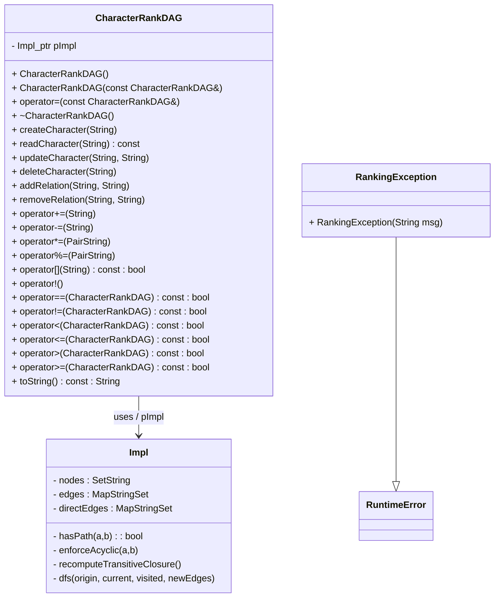

# Overview
Transitive Character Ranking Calculator based on a Directed Acyclic Graph (DAG) ADT. This structure handles transitive relations (if A > B and B > C, then A > C).

## UML Diagram

## Make options
- make -f makefile.txt            builds default target (module + demo)
- make -f makefile.txt run-demo   runs demo
- make -f makefile.txt run-test   runs test
- make -f makefile.txt clean      cleans all
- make -f makefile.txt rebuild    rebuilds from scratch

